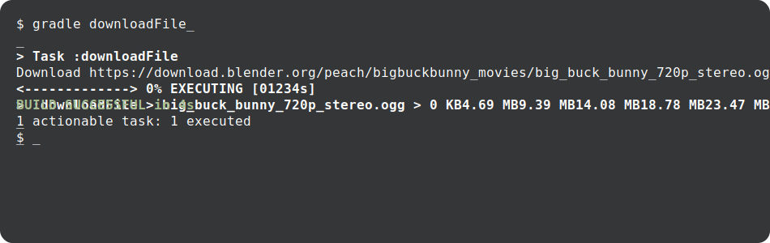

# gradle-download-task screencast

This directory contains a screencast showcasing how gradle-download-task works.

## Building

    npm i
    npm run build

The screencast will be saved as `screencast.svg`.
